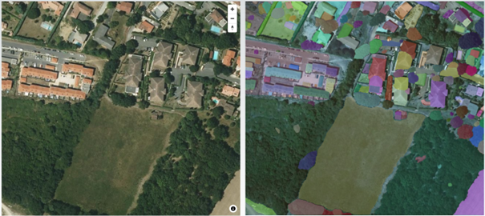

<p align="center">
  <a href="https://nextjs-fastapi-starter.vercel.app/">
    
    <h3 align="center">Next.js FastAPI Starter</h3>
  </a>
</p>

<p align="center">Simple Next.js boilerplate that uses <a href="https://fastapi.tiangolo.com/">FastAPI</a> as the API backend.</p>

Forked from `https://github.com/digitros/nextjs-fastapi`

## First App : Satellite image segmentation

Install torch for cuda :

```bash
pip3 install torch torchvision torchaudio --index-url https://download.pytorch.org/whl/cu118
```

Create a `.env` file and define a `NEXT_PUBLIC_MAPTILER_API_KEY` key

Download model checkpoints from [this link](https://github.com/facebookresearch/segment-anything#model-checkpoints) and put them in [`/api/models`](/api//models/README.md)

By default, the code supports sam_vit_b_01ec64.pth weights.

Here are the type of images you can get :


